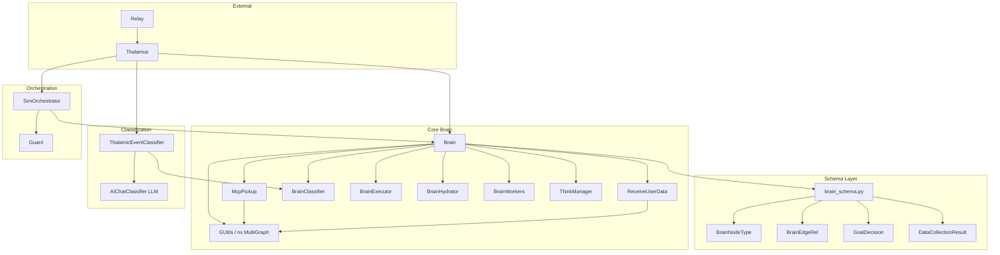
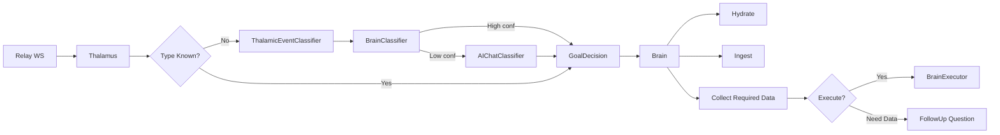
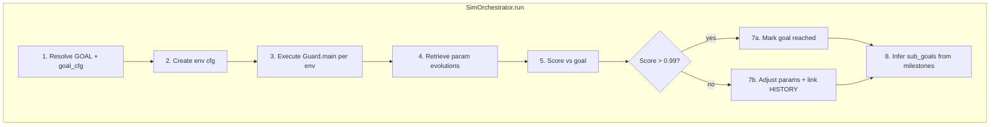
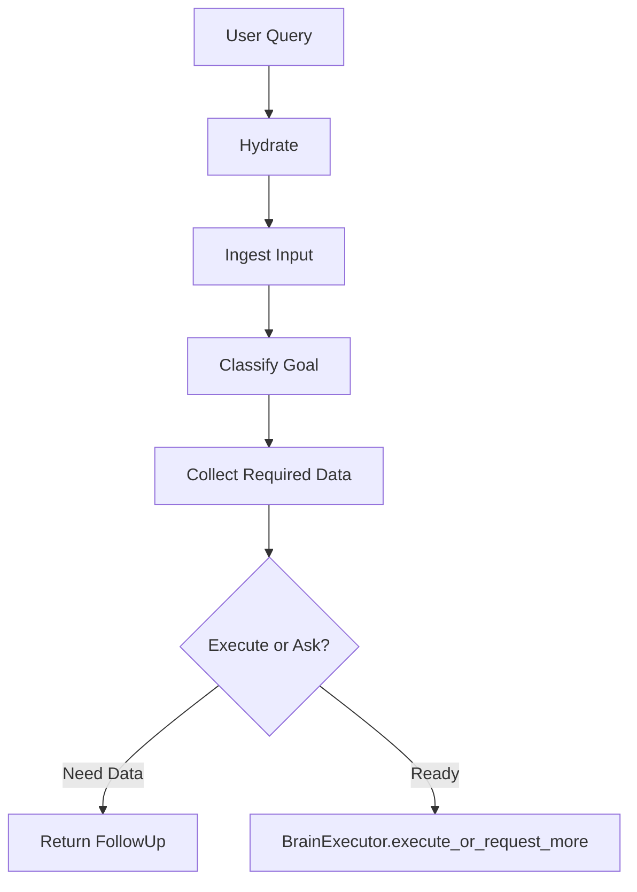
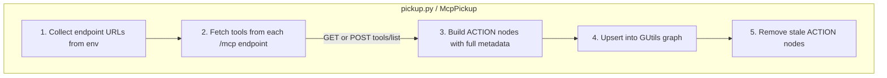
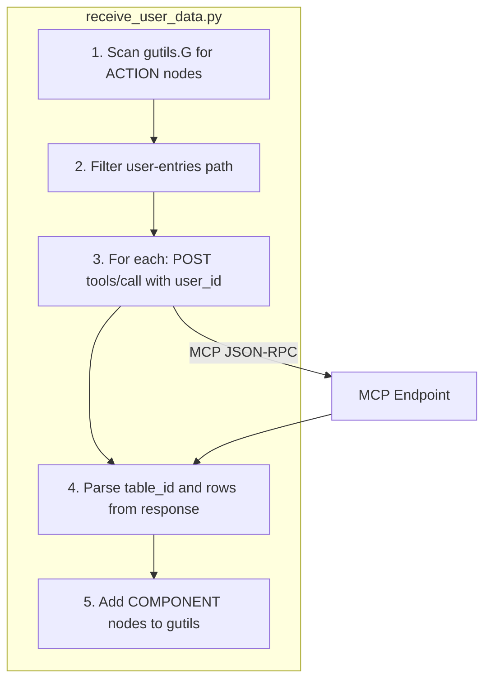

# brainmaster

A modular Brain that acts as a user–sys interface. It consumes given MCPs, plans, executes and interacts with the user — fully local (no cloud-based LLM included, but extensible). Pls post issue requests if you like it.

---

## 🧠 What Is Brainmaster? (Plain English)

Imagine you have a very organised personal assistant who:

- **Remembers everything** about you and your previous work — your files, settings, goals, and history.
- **Understands what you want** even if you say it in different ways — like "run my simulation" or "start the test environment", it figures out you mean the same thing.
- **Figures out what it needs** before acting — if something is missing, it asks you just for that missing piece instead of giving up.
- **Takes action** by connecting to your tools and services, calling the right one at the right time.
- **Runs simulations** on your behalf, scores the results, and tells you what to change to get closer to your goal.

This "assistant" is Brainmaster. It is a **locally running AI brain** that sits between you and your tools, helping you orchestrate complex workflows without needing to manually wire everything together.

---

## 🗺️ Project Pathway (Non-Technical Overview)

Below is the journey of a request — from what you type to what happens behind the scenes:

```
You type a message
       │
       ▼
┌─────────────────────────────────────────────────────┐
│  Step 1 — Understand your intent                    │
│                                                     │
│  Brainmaster reads your message and classifies it:  │
│  "Is this a chat? A simulation request? A file      │
│   upload? Something else?"                          │
│                                                     │
│  It uses a mix of keyword rules, similarity         │
│  matching, and an optional local AI model.          │
└──────────────────────┬──────────────────────────────┘
                       │
                       ▼
┌─────────────────────────────────────────────────────┐
│  Step 2 — Recall what it already knows about you    │
│                                                     │
│  It looks up your stored data: parameters, files,   │
│  environment configs, and previous session history. │
│  Everything is kept locally on your machine.        │
└──────────────────────┬──────────────────────────────┘
                       │
                       ▼
┌─────────────────────────────────────────────────────┐
│  Step 3 — Check if it has everything it needs       │
│                                                     │
│  Does it have all the required inputs for           │
│  the task? If yes → proceed. If no → ask you        │
│  only for the missing piece, and suggest likely     │
│  values based on your history.                      │
└──────────────────────┬──────────────────────────────┘
                       │
                       ▼
┌─────────────────────────────────────────────────────┐
│  Step 4 — Execute the task                          │
│                                                     │
│  It calls the right tool or service (via MCP),      │
│  runs your simulation, processes your file, or      │
│  answers your question.                             │
└──────────────────────┬──────────────────────────────┘
                       │
                       ▼
┌─────────────────────────────────────────────────────┐
│  Step 5 — Report and remember                       │
│                                                     │
│  Results are returned to you. The outcome, the      │
│  parameters used, and any adjustments are stored    │
│  so future requests are smarter and faster.         │
└─────────────────────────────────────────────────────┘
```

---

## ✨ What Can You Do With Brainmaster?

| Possibility | What it means in plain terms |
|-------------|------------------------------|
| **Run simulations** | Tell the system your goal ("reach equilibrium at value X") and let it run, score, and refine the simulation parameters automatically until the goal is met. |
| **Connect your own tools** | Plug in any service that speaks the MCP protocol. Brainmaster will discover the tools automatically and learn how to call them. |
| **Ask questions in natural language** | Instead of writing code or filling forms, just describe what you want. The brain classifies your request and routes it correctly. |
| **Let it remember your work** | Every session, environment, file, and parameter you ever used is stored. The brain uses this history to pre-fill fields and make smarter suggestions. |
| **Get guided through missing data** | If the brain can't act yet because information is missing, it asks you only the relevant questions — and suggests likely answers from your history. |
| **Keep everything local** | No data leaves your machine unless you explicitly connect a remote service. The AI classification, memory, and execution all run on your hardware. |
| **Extend with any language model** | The LLM slot is optional and pluggable. You can connect any local or remote model (e.g., Ollama, OpenAI-compatible API) as a fallback classifier. |

---

## 🔌 How Does It Connect to Your Tools?

Brainmaster uses the **MCP (Model Context Protocol)** standard. Think of MCP as a universal plug adapter for AI tools:

1. You run a service (e.g., a simulation backend, a file processor, a database API) that exposes an `/mcp` endpoint.
2. You tell Brainmaster the address of that endpoint via an environment variable (e.g., `MCP_EP=http://localhost:9000`).
3. Brainmaster automatically discovers all available tools from that service and registers them in its internal knowledge graph.
4. From then on, when you make a request, it knows it can call those tools and will do so when appropriate.

No manual wiring, no code changes needed on your end.

---

## 🧩 Key Concepts in Simple Terms

| Technical Term | Plain English Meaning |
|----------------|-----------------------|
| **Brain** | The central orchestrator — reads, thinks, remembers, and acts |
| **Graph** | A map of everything the brain knows: your files, goals, history, and tools — all connected |
| **Pathway / Case** | A specific type of task the brain knows how to handle (e.g., start a simulation, upload a file, answer a question) |
| **Goal** | What you are trying to achieve; the brain creates a goal node and tracks progress toward it |
| **Short-term memory** | The last ~30 messages in your current conversation — like working memory |
| **Long-term memory** | Everything stored from previous sessions: parameters, files, environments, methods |
| **MCP Tool / Action** | A callable function exposed by a connected service — the brain's "hands" |
| **Simulation** | A computational run of your configured physics/logic environment; results are scored against your goal |
| **Thalamus** | The entry point / router — receives your message and directs it to the right handler |
| **Classification** | The step where the brain decides what type of request you made |

---

# brn — Brain Graph & Orchestration

The **brn** package provides the Brain graph system: goal classification, long/short-term memory, relay-case execution, and simulation orchestration. It sits between the **Thalamus** (orchestrator) and domain managers (Guard, QBrain, etc.).

---

## Component Map



---

## Component Overview

| Component | File | Purpose |
|-----------|------|---------|
| **Brain** | `brain.py` | Main orchestrator. Extends GUtils, owns graph, hydrates memory, classifies goals, executes cases. |
| **BrainClassifier** | `brain_classifier.py` | Hybrid rule + vector classification into `GoalDecision` (case, confidence, source). |
| **BrainExecutor** | `brain_executor.py` | Gates execution: `execute_or_request_more` → need_data \| executed \| error. |
| **BrainHydrator** | `brain_hydrator.py` | DuckDB/QBrain → LONG_TERM_STORAGE nodes for user-scoped memory. |
| **BrainWorkers** | `brain_workers.py` | Bounded thread pool for embedding/hydration offload. |
| **ThinkManager** | `think_manager.py` | Graph-aware helper: suggest missing fields, analyze case context. |
| **SimOrchestrator** | `sim_orchestrator.py` | Start-sim workflow: resolve goal → create env cfg → Guard.main → score → adjust. |
| **McpPickup** | `pickup.py` | Fetches MCP tools from all /mcp endpoints; consumes as ACTION nodes into GUtils. |
| **ReceiveUserData** | `receive_user_data.py` | Scans ACTION nodes for user-entries routes; calls via MCP tools/call with user_id; adds COMPONENT nodes. |
| **ThalamicEventClassifier** | `thalamic_classifier/` | Facade: BrainClassifier first, AIChatClassifier fallback when confidence low. |
| **brain_schema** | `brain_schema.py` | BrainNodeType, BrainEdgeRel, GoalDecision, DataCollectionResult. |

---

## Workflows

### 1. Relay → Thalamus → Brain (Chat / Typed Cases)



### 2. SimOrchestrator (Start-Sim)



### 3. Brain.execute_or_ask (High-Level)



### 4. MCP Pickup (McpPickup → GUtils)



**Steps:**

| Step | Action |
|------|--------|
| 1 | Read `BRAIN_MCP_ENDPOINTS`, `MCP_EP`, `MCP_EP_*` from env; parse JSON list or comma/semicolon delimited. |
| 2 | For each endpoint: GET JSON or POST `tools/list` (JSON-RPC fallback). Extract tools from payload. |
| 3 | Build ACTION node per tool: `id`, `type`, `user_id`, `action_name`, `title`, `description`, `input_schema`, `source_endpoint`, `updated_at`. |
| 4 | Upsert nodes into GUtils via `add_node()` under graph lock. |
| 5 | Remove ACTION nodes whose `source_endpoint` no longer returns that tool (stale cleanup). |

**Env vars:** `BRAIN_MCP_ENDPOINTS`, `MCP_EP`, `MCP_EP_LOCAL`, etc.; `BRAIN_MCP_POLL_INTERVAL_SEC`, `BRAIN_MCP_HTTP_TIMEOUT_SEC`.

### 5. ReceiveUserData (hydrate_user_context)



**Steps:** Scan ACTION nodes for `user-entries` or `user_entries` in action_name/description/source_endpoint; call each via MCP `tools/call` with `{"user_id": user_id}`; parse `table_id` and `rows` from response; add COMPONENT nodes with `sub_type` = table_id. Invoked from `hydrate_user_context()` after BrainHydrator.

---

## Low-Entry Understanding

### What is the Brain?

The Brain is a **graph + DB hybrid** that:

1. **Remembers** — Hydrates user-scoped data from DuckDB into LONG_TERM_STORAGE nodes.
2. **Understands** — Classifies user intent into relay cases (ENV, FILE, PARAM, etc.) via rules + vectors.
3. **Acts** — Collects required fields and executes the chosen case handler when data is complete.

### How does classification work?

1. **Rule** — Exact match on case name/description.
2. **Vector** — Embed similarity over case descriptions.
3. **LLM** — Fallback when confidence is low (ThalamicEventClassifier).

### What is SimOrchestrator?

A Brain sub-module that runs the **start-sim** flow:

- Resolves GOAL → creates env config → runs Guard → scores results → adjusts params.
- Links ENV → GOAL via HISTORY edges when goals are not yet reached.

### What is ThinkManager?

A helper around the graph that:

- Suggests candidate values for missing case fields.
- Analyzes case context and traces component relationships.

---

## Areas of Improvement

### 1. Import Path Unification

**Current:** `brn` lives at project root; some code imports from `qbrain.graph.brn.*` while others use `brn.*`.

**Improvement:** Choose one canonical path (e.g. `brn`) and update all imports. Add `qbrain.graph.brn` as a re-export or deprecation if needed.

---

### 2. ThalamicEventClassifier vs BrainClassifier

**Current:** ThalamicEventClassifier wraps BrainClassifier + AIChatClassifier with a confidence threshold.

**Improvement:** Merge or formalize as a clear strategy chain:
- Rule → Vector → LLM (with configurable thresholds).
- Single `Classifier` interface with pluggable backends.

---

### 3. BrainExecutor + Brain

**Current:** `execute_or_request_more` lives in BrainExecutor; Brain calls it and handles result routing.

**Improvement:** Keep BrainExecutor focused on execution + payload guard. Move “collect required data” and “follow-up question” logic into a dedicated `DataCollector` or `CaseResolver` so Brain stays thin.

---

### 4. ThinkManager + Brain

**Current:** ThinkManager is separate and graph-aware; Brain uses it for suggestions.

**Improvement:** Ensure ThinkManager stays read-only and stateless. Document which methods are used by which flows. Consider a small `ThinkContext` dataclass for common inputs.

---

### 5. SimOrchestrator vs Thalamus

**Current:** Thalamus delegates START_SIM to SimOrchestrator; `_handle_start_sim_process` remains as legacy fallback.

**Improvement:** Remove legacy path once SimOrchestrator is stable. Share goal-resolution logic (e.g. `_resolve_goal_and_cfg`) with Brain if both need it.

---

### 6. BrainOperator

**Current:** Stub class with empty `main()`.

**Improvement:** Either implement or remove. If kept, define a clear contract (e.g. operator over graph nodes).

---

### 7. Schema Placement

**Current:** `brain_schema` is the single source of truth; used by Brain, GraphProcessor, SimOrchestrator, etc.

**Improvement:** Keep as-is. Consider moving to `qbrain.graph.schema` if it becomes shared across graph packages.

---

### 8. BrainWorkers

**Current:** Thread pool for embedding/hydration.

**Improvement:** If similar patterns exist in qbrain (e.g. batch embedding), consider a shared `qbrain.utils.workers` or `qbrain.utils.offload`.

---

### 9. Planning & Feedback Loop (Cursor-style)

**Current:** No agentic planning loop. Brain and SimOrchestrator are single-pass: one request → one response. If `need_data`, user must call again. SimOrchestrator scores and suggests param adjustments but does not re-run; no automatic iteration until goal reached.

**Improvement:** Add planning/feedback mechanisms:

- **Plan → Execute → Observe → Replan loop** — Agent loop that continues until goal met or stopping condition.
- **Next-step planning** — After execution, infer next steps from result (success, partial, error) and optionally auto-continue.
- **SimOrchestrator re-run loop** — When score < threshold: apply suggested adjustments → re-run Guard.main → re-score; loop until goal reached or max iterations.
- **Feedback-driven iteration** — BrainExecutor/Brain: on `need_data`, optionally use ThinkManager + graph context to auto-suggest and retry with inferred values where safe.

---

## File Layout

```
brn/
├── README.md
├── main.py               # Entry: hardcoded REQUEST_SCHEMA, workflow triggers, --serve
├── __init__.py
├── brain.py
├── brain_schema.py
├── brain_utils.py          # normalize_user_id, shared helpers
├── brain_graph_utils.py    # get_sub_goal_ids_for_goal, graph traversal
├── mcp_client.py
├── pickup.py
├── receive_user_data.py
├── brain_classifier.py
├── brain_executor.py
├── brain_hydrator.py
├── brain_workers.py
├── think_manager.py
├── sim_orchestrator.py
├── brain_operator.py
├── test_think_manager.py
└── thalamic_classifier/
    ├── __init__.py
    └── thalamic_event_classifier.py
```

---

## Related Docs

- [SIM_ORCHESTRATOR_WORKFLOW.md](../qbrain/docs/SIM_ORCHESTRATOR_WORKFLOW.md) — SimOrchestrator step-by-step
- [PROMPT_BRAIN_GRAPH_DUCKDB_HYBRID.md](../qbrain/docs/PROMPT_BRAIN_GRAPH_DUCKDB_HYBRID.md) — Brain design
